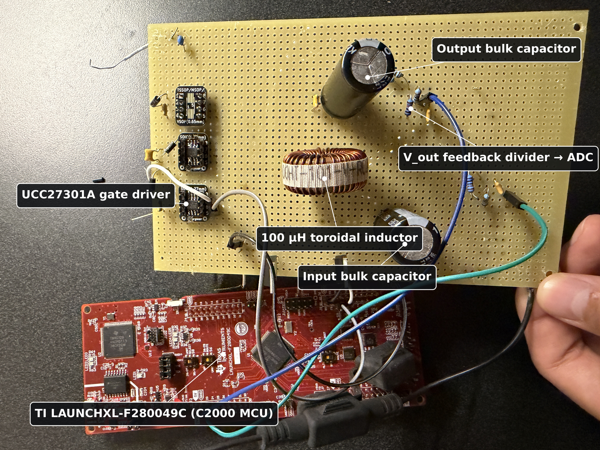
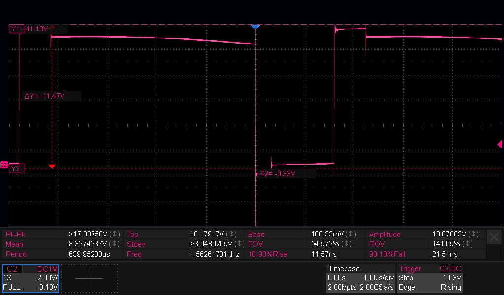
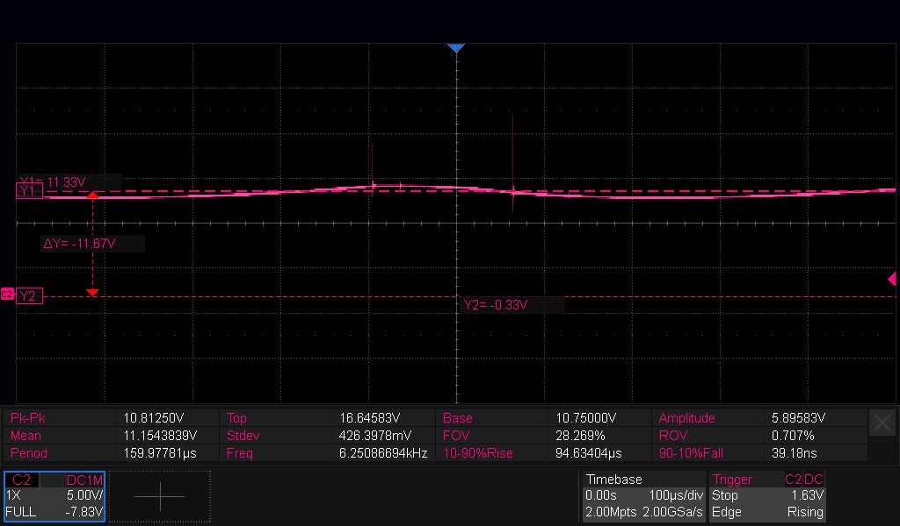
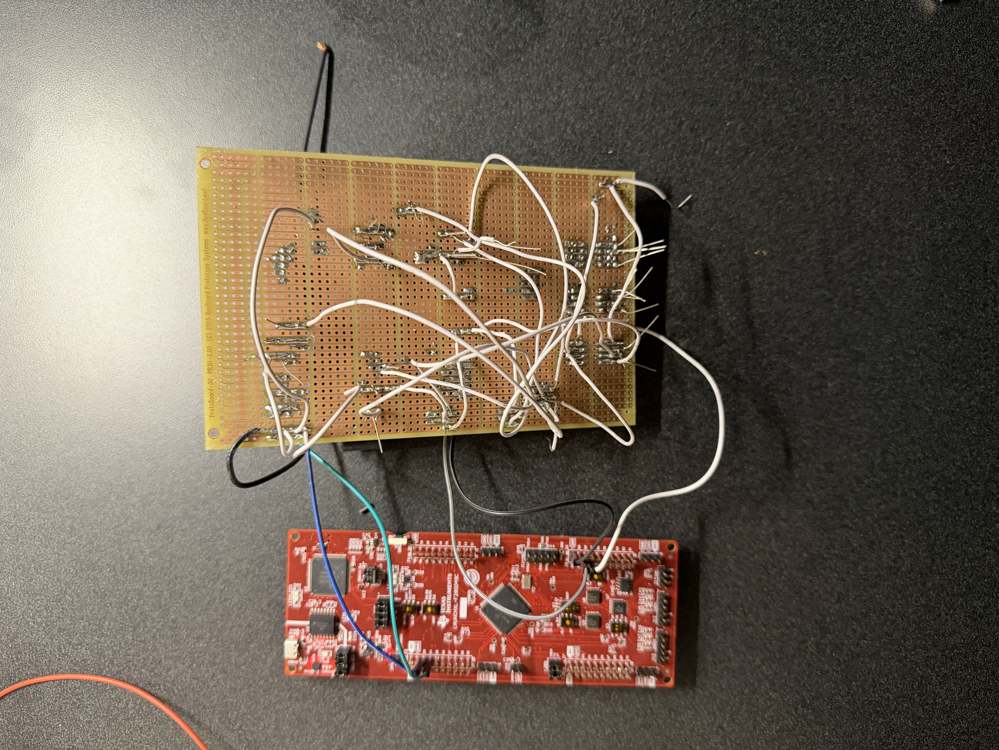

# C2000 Bidirectional DC-DC Converter

A bidirectional DC-DC converter controlled by a Texas Instruments C2000 microcontroller. I built the project to get hands-on experience controlling a real power-electronics system with embedded firmware.

The converter supports buck and reverse/boost operation and includes PWM control, ADC voltage sensing, soft-start, and fault protection.

## Hardware Prototype

<p align="center">
  
</p>

The prototype uses a TI LAUNCHXL-F280049C C2000 LaunchPad to control a discrete converter stage assembled on perfboard.

### Main Hardware

- TI LAUNCHXL-F280049C C2000 LaunchPad
- UCC27301A gate driver
- IPP110N20N3 MOSFET switching stage
- 100 µH toroidal inductor
- Input and output bulk capacitors
- Resistor-divider voltage sensing connected to the C2000 ADC
- Custom perfboard power stage

## What I Implemented

I wrote the converter firmware in C using Code Composer Studio and the C2000 DriverLib.

My work included:

- Complementary PWM generation
- Dead-band configuration
- Duty-cycle control
- ADC-based voltage measurement
- Soft-start behavior
- Overvoltage protection
- Emergency shutdown
- PWM disable during fault conditions
- Buck-mode operation
- Reverse / boost-mode operation

The project originally started from a Texas Instruments ePWM dead-band example, which I modified and extended for the converter hardware and control requirements.

The main application code is in:

```text
epwm_ex8_deadband.c
```

## PWM and Switching Control

The C2000 generates the PWM signals used to drive the converter switching stage.

Complementary switching is used for the high-side and low-side devices, with dead time inserted between transitions to reduce the risk of both MOSFETs conducting at the same time.

The firmware changes the commanded duty cycle depending on the desired operating point and direction of power conversion.

## Voltage Sensing

Converter voltage is measured using a resistor-divider network connected to the C2000 ADC.

The firmware converts the ADC reading back into an estimated converter voltage and uses the measurement for monitoring and protection.

## Soft-Start and Fault Protection

Instead of immediately applying the final duty cycle at startup, the firmware gradually ramps toward the commanded operating point.

Protection behavior includes:

- Output overvoltage detection
- Emergency shutdown
- PWM disable during fault conditions

## Testing and Validation

I tested the converter using a bench power supply, resistive loads, and an oscilloscope.

### Switching-Node Measurement

<p align="center">
  
</p>

*Switching-node waveform measured under a 50 Ω load. The scope shows approximately 1.56 kHz switching frequency and 54.6% duty cycle.*

This measurement was used to verify that the switching stage was responding to the PWM command and transitioning between the expected voltage levels.

### Buck-Mode Output

<p align="center">
  
</p>

*Buck-mode output measurement with a 15 V input. The measured output averaged approximately 11.15 V, with switching transients visible in the waveform.*

This capture shows the filtered converter output at a lower voltage than the input, confirming step-down operation.

Additional buck-mode tests included approximately:

- 10 V input → 3.0 V output at about 0.30 duty cycle
- 10 V input → 5.0 V output at about 0.58 duty cycle

The converter was also operated in the reverse direction to demonstrate boost operation.

## Prototype Construction

<p align="center">
  
</p>

The converter power stage was assembled manually on perfboard. The underside wiring connects the switching devices, gate-driver circuitry, passive components, sensing network, and C2000 development board.

Building the circuit this way also made it possible to directly probe internal circuit nodes while debugging the hardware and firmware together.

## Repository Structure

```text
c2000-bidirectional-dc-dc-converter/
├── epwm_ex8_deadband.c
├── epwm_ex8_deadband.syscfg
├── device/
├── targetConfigs/
├── docs/
│   └── images/
│       ├── dcdc_converter_labeled.jpg
│       ├── 10V_test_node_50ohmload.jpg
│       ├── 15V_test.jpg
│       └── IMG_2692.JPG
├── .ccsproject
├── .cproject
├── .project
└── README.md
```

The `device/` directory contains Texas Instruments C2000 DriverLib support files used by the project.

## Development Tools

- C
- Code Composer Studio
- TI C2000 DriverLib
- C2000 ePWM
- C2000 ADC
- Oscilloscope-based hardware testing

## What I Learned

The biggest part of this project was learning how embedded firmware and the physical power stage affect each other.

Debugging required checking both sides of the system: PWM timing and ADC behavior in the firmware, and switching waveforms, voltage levels, and wiring on the hardware. It gave me practical experience bringing up and testing a real embedded power-electronics system rather than only working with firmware in isolation.